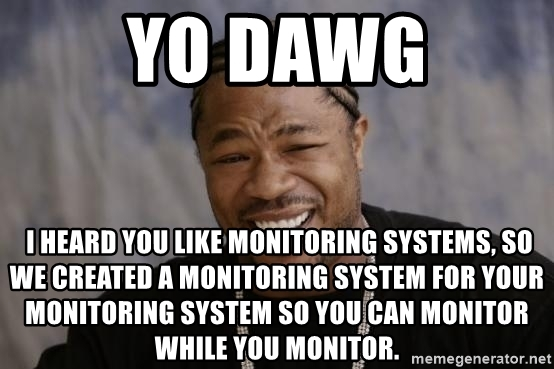

### Monitoring K3S with Prometheus Operator

This repository contains the resources for my talk on this topic given at a Civo Cloud Community Meetup. I'll link the video when it's available.

Prometheus can be complicated to get started with, which is why many people pick hosted monitoring solutions like Datadog. However it doesn't have to be and if you're monitoring Kubernetes, Prometheus is in my opinion the best option.

The great people over at CoreOS developed a Prometheus Operator for Kubernetes which allows you to define your Prometheus configuration in YAML and deploy it alongside your application manifests. This makes a lot of sense if you're deploying a lot of applications, maybe across many teams. They can all just define their own monitoring alerts.

You will need:
- A k3s cluster (on an x86 architecture for now) like Civo Cloud
- kubectl installed on your machine and configured for that cluster
- Helm 3 installed on your machine

I'm using Mailhog to receive my alerts for this demo because it's simple. However you might choose to hook into your mail provider to send emails (see commented settings for Gmail example) or send a Slack message (see Prometheus documentation). To install mailhog:

```
helm repo add codecentric https://codecentric.github.io/helm-charts
helm upgrade --install mailhog codecentric/mailhog
```

## Install Prometheus Operator

Now installing Prometheus Operator from the Helm chart is as simple as running:
```
helm repo add stable https://kubernetes-charts.storage.googleapis.com/
helm upgrade --install prometheus stable/prometheus-operator --values prometheus-operator-values.yaml
```

This deploys Prometheus, Alert Manager and Grafana with a few options disabled which don't work for k3s. You'll get a set of default Prometheus Rules (Alerts) configured which will alert you about most of things you need worry about when running a Kubernetes cluster.

There are a few commented out sections like CPU and Memory resource requests and limits which you should definitely set when you know the resources each service needs in your environment. 

I also recommend setting up some Pod Priority Classes in your cluster and making the core parts of the system a high priority so if the cluster is low on resources Prometheus will still run and alert you. 

Under routes you will see I've sent a few of the default Prometheus Rules to the `null` receiver which effectively mutes them. You might choose to remove some of these or add different alerts to the list.

Each time you change your values file, just re-run the `helm upgrade` command above for Helm to apply your changes.

## Accessing Prometheus, Alert Manager and Grafana

I haven't configured any Ingress or Load Balancers for access to the services in my values file. This is because Prometheus and Alert Manager don't support any authentication out of the box and Grafana will be spun up with default credentials (Username: `admin` and Password: `prom-operator`). In our production environments we use oauth2-proxy to put Google authentication in front of these services. You could also set up Basic Authentication using Traefik.

This means you need to use `kubectl port-forward` to access the services for now. In separate terminal windows run the following commands:

```
kubectl port-forward svc/prometheus-grafana 8080:80
kubectl port-forward svc/prometheus-prometheus-oper-prometheus 9090
kubectl port-forward svc/prometheus-prometheus-oper-alertmanager 9093
```

This will make Grafana accessible on http://localhost:8080, Prometheus on http://localhost:9090 and Alert Manager on http://localhost:9093

You'll see that Grafana is already configured with lots of useful dashboards and Prometheus is configured with Rules to send alerts for pretty much everything you need to monitor in a production cluster.

## The power of Prometheus Operator

Because k3s uses Traefik for ingress, we want to add monitoring to that. Prometheus "scrapes" services to get metrics rather than having metrics pushed to it like many other systems. Many "cloud native" applications will expose a port for Prometheus metrics out of the box and Traefik is no exception. For any apps you build you will need a metrics endpoint and a Kubernetes Service with that port exposed.

All we need to do to get Prometheus scraping Traefik is add a Prometheus Operator `ServiceMonitor` resource which tells it the details of the existing service to scrape. 

```
kubectl apply -f traefik-servicemonitor.yaml
```

You can also do something similar with Grafana dashboards. Just deploy them in a `ConfigMap` like this:

```
kubectl apply -f traefik-dashboard.yaml
```

For this reason we haven't configured Grafana with any persistent storage so any dashboards imported or created and not put in a ConfigMap will disappear if the Pod restarts.

We can now create alerts with Prometheus Rules using the Prometheus Operator `PrometheusRule`:

```
kubectl apply -f traefik-prometheusrule.yaml
```

## Blackbox Exporter

I've also configured Prometheus Blackbox exporter on my cluster which polls HTTP endpoints. These can be anywhere on the Internet. In this case I'm just monitoring my example website to check everything is working as expected. I've also deployed another dashboard to Grafana for it.

```
helm upgrade --install blackbox-exporter stable/prometheus-blackbox-exporter --values blackbox-exporter-values.yaml
kubectl apply -f blackbox-exporter-dashboard.yaml
```

## Monitoring the monitoring



But what if my cluster goes down and my monitoring goes with it? One of the alerts we have sent to the `null` receiver in the Prometheus Operator values is `Watchdog`. This is a Prometheus Rule which always fires. If you send this to somewhere outside of your cluster, you can be alerted if this "Dead Man's Switch" stops firing.

At Pulselive we developed a simple solution using AWS Lambda for this (https://github.com/PulseInnovations/prometheus-deadmansswitch)
